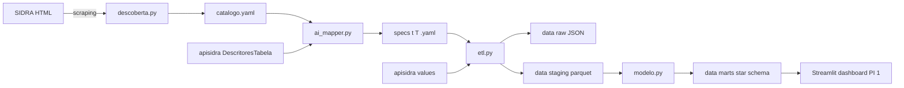
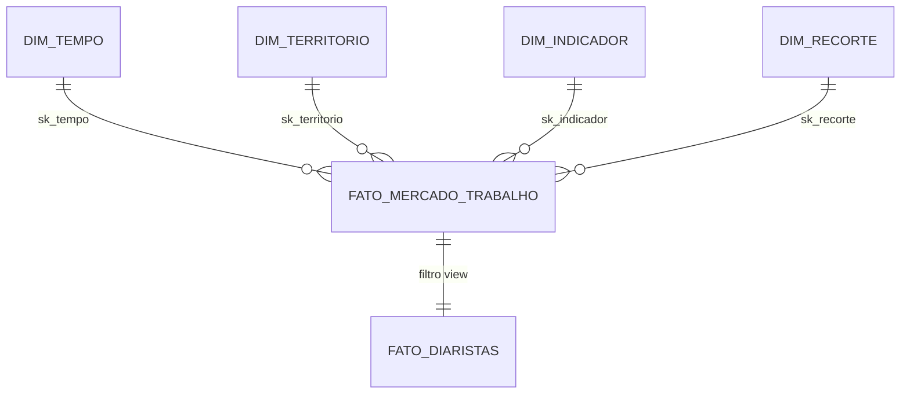

# Metodologia — Pipeline SIDRA → PED-like (PI 1: Diaristas)

> Documento principal de entrega do projeto integrador. Descreve a problemática, o desenho técnico do pipeline, o modelo dimensional inspirado na PED do IPEDF, o catálogo de tabelas SIDRA usadas e as instruções de uso.

## 1. Contexto — Projeto Integrador I

Este pipeline alimenta a frente **secundária / macroeconômica** do Dashboard de Análise da Problemática do PI 1, cujo tema é **Trabalho Autônomo ou Informal** com recorte em **diaristas** (serviços domésticos / Gig Economy).

- **Metodologia**: Design Thinking — etapas de **Empatia** (ouvir diaristas e contratantes) e **Definição** (delimitar o problema).
- **ODS 8 — Trabalho Decente e Crescimento Econômico**: o dashboard precisa evidenciar o gap entre informalidade observada (PNAD-C) e formalização possível (MEI, eSocial doméstico).
- **Repositório-mãe**: <https://github.com/Lucas-Balduino/projetointegrador>

### 1.1. Tensões da problemática (a serem ilustradas com dados)

| Tensão | Onde aparece nos dados |
| --- | --- |
| Desintermediação (cliente fechando por fora da plataforma) | Tabela 6383 — nº de domicílios por trabalhador (proxy de fidelização) |
| Segurança e confiança | (fora do escopo de dados públicos — entra via pesquisa primária) |
| Precarização × plataformização | Tabela 4097 (carteira/sem carteira), 8529 (taxa de informalidade), 5440 (rendimento) |
| Desigualdade de gênero/raça | Tabelas 4093 (sexo) e 6402 (cor ou raça) |

### 1.2. Frentes de pesquisa do PI 1

```text
Primária (Clientes) ─────────► Google Forms / entrevistas      [fora deste pipeline]
Primária (Diaristas) ────────► WhatsApp / grupos / indicação   [fora deste pipeline]
Secundária (Mercado)  ───────► IBGE PNAD-C SIDRA               [ESTE pipeline]
Secundária (Legal)    ───────► MPT / OIT / FENATRAD / eSocial  [docs/referencias.md]
```

## 2. Correção de escopo na fonte SIDRA

O link inicial enviado para o trabalho — `https://sidra.ibge.gov.br/home/primpec/brasil` — aponta para **Primeiras Estimativas da Pecuária** (bovinos, leite, ovos). Não tem aderência ao tema. As fontes corretas são:

- **PNADC Trimestral**: <https://sidra.ibge.gov.br/pesquisa/pnadct/tabelas>
- **PNADC Mensal**: <https://sidra.ibge.gov.br/pesquisa/pnadcm>
- **API REST oficial**: <https://apisidra.ibge.gov.br/>

A correção está registrada no [README.md](../README.md).

## 3. Arquitetura do pipeline



Cada etapa é idempotente: re-execuções usam cache local (hash da URL como chave) e sobrescrevem somente o que mudou.

## 4. Mapeamento PED-IPEDF ↔ PNAD-C/SIDRA

A PED do DIEESE/IPEDF organiza o mercado de trabalho em **categorias** (PIA, PEA, Ocupados, Desempregados, Inativos) e **indicadores** (taxa de participação, taxa de desemprego, rendimento médio). Reconstruímos isso a partir das tabelas da PNAD Contínua:

| Categoria PED | Definição | Tabela(s) SIDRA |
| --- | --- | --- |
| **PIA** (Pop. em Idade Ativa, 14+) | Pessoas com 14 anos ou mais | 4092 (total geral) |
| **PEA** (Pop. Economicamente Ativa) | Ocupados + desocupados (na força de trabalho) | 4092 |
| **Ocupados** | Trabalharam ≥ 1h na semana de referência | 4092, 4096, **4097** (detalhe por posição/categoria), 5434, 5435 |
| **Desempregados (aberto)** | Procuraram trabalho nos 30 dias anteriores | 4092, 4099, **6468** (taxa) |
| **Desemprego oculto (PED) → proxy PNAD** | PED separa em "precário" + "desalento"; PNAD não. Aproximamos com: | **6813** (desalentados) + **4100** (subutilização) |
| **Inativos** | Fora da força de trabalho | 4092 |
| **Rendimento** | Rendimento médio real mensal | **5440** (por posição/categoria — diferencia trab. doméstico com/sem carteira), 5436, 6471 |
| **Horas** | Horas habitualmente/efetivamente trabalhadas | **6374** (por posição na ocupação) |
| **Informalidade** | Sem carteira / sem CNPJ / sem contribuição | 4093, 6402, **8517**, **8529** (taxa) |

### 4.1. Identificação de diaristas no SIDRA

A PNAD-C **não tem uma flag "diarista"** — a identificação é feita por cruzamento:

1. Filtro: `posição na ocupação = Trabalhador doméstico` (tabela **4097**).
2. Subdivisão diarista × mensalista: tabela **6383** — `número de domicílios em que trabalhavam` (1 domicílio ≈ mensalista; 2+ ≈ diarista).
3. Indicadores adicionais cruzados (mesma tabela 4097): com/sem carteira de trabalho.

## 5. Modelo dimensional (star schema PED-like)



### Dicionário

- **`dim_tempo`** — `sk_tempo`, `periodo_codigo` (YYYYQQ ou YYYYMM), `periodo_nome`, `ano`, `periodicidade` (trimestral/mensal-móvel).
- **`dim_territorio`** — `sk_territorio`, `nivel_codigo`, `nivel` (Brasil / UF / RM / RD / Município), `territorio_codigo`, `territorio_nome`.
- **`dim_indicador`** — `sk_indicador`, `tabela` (origem SIDRA), `variavel_id`, `variavel_nome`, `unidade`, `categoria_ped` (lista das categorias PED a que pertence).
- **`dim_recorte`** — `sk_recorte`, `eixo` (sexo, idade, cor/raça, posição na ocupação, categoria do emprego, situação de informalidade, nº de domicílios, ...), `valor_id`, `valor_nome`. Sempre tem uma linha "Total".
- **`fato_mercado_trabalho`** — `sk_tempo`, `sk_territorio`, `sk_indicador`, `sk_recorte`, `valor` (float), `valor_raw` (string original), `unidade_medida_nome`, `tabela`.
- **`fato_diaristas`** — view materializada: subconjunto de `fato_mercado_trabalho` cujas linhas têm origem em tabela do bloco **diaristas** (4097, 5440, 6374, 6383, 6385, 6386) ou cuja `dim_recorte` aponta para uma categoria contendo "doméstico" / "diarista".

## 6. Catálogo SIDRA utilizado

O catálogo curado fica em [`pipeline/catalogo.yaml`](../pipeline/catalogo.yaml). Resumo das tabelas marcadas como **prioridade alta**:

| Tabela | Nome curto | Bloco | API descritor |
| --- | --- | --- | --- |
| 4092 | PIA por condição de força de trabalho | mercado_geral | [t/4092](https://apisidra.ibge.gov.br/DescritoresTabela/t/4092) |
| 4093 | Informalidade por sexo | informalidade / recortes | [t/4093](https://apisidra.ibge.gov.br/DescritoresTabela/t/4093) |
| **4097** | Ocupados por posição na ocupação e categoria do emprego | diaristas | [t/4097](https://apisidra.ibge.gov.br/DescritoresTabela/t/4097) |
| **5440** | Rendimento médio por posição na ocupação | rendimento / diaristas | [t/5440](https://apisidra.ibge.gov.br/DescritoresTabela/t/5440) |
| **6374** | Horas trabalhadas por posição na ocupação | horas / diaristas | [t/6374](https://apisidra.ibge.gov.br/DescritoresTabela/t/6374) |
| **6383** | Trabalhadores domésticos por nº de domicílios | diaristas | [t/6383](https://apisidra.ibge.gov.br/DescritoresTabela/t/6383) |
| 6402 | Informalidade por cor/raça | informalidade / recortes | [t/6402](https://apisidra.ibge.gov.br/DescritoresTabela/t/6402) |
| 8517 | Ocupados por situação de informalidade | informalidade | [t/8517](https://apisidra.ibge.gov.br/DescritoresTabela/t/8517) |
| 8529 | Taxa de informalidade | informalidade | [t/8529](https://apisidra.ibge.gov.br/DescritoresTabela/t/8529) |

(O catálogo completo cobre 22 tabelas, incluindo prioridade média/baixa.)

### Padrão de URL da API

- Valores: `https://apisidra.ibge.gov.br/values/t/{T}/n{N}/{unidades}/p/{P}/v/{V}/c{Ci}/{cats}/f/u`
- Descritor (JSON): `https://apisidra.ibge.gov.br/DescritoresTabela/t/{T}`
- Exemplo: `https://apisidra.ibge.gov.br/values/t/4097/n1/all/v/all/p/last/c11913/allxt/f/u`

## 7. Pesquisa primária (formulários locais)

Arquivos de entrada (repositório `ProjetoIntegrador`):

- `PesquisaFormularios/pesquisa-contratante.xlsx` — 106 respostas
- `PesquisaFormularios/pesquisa-diaristas.xlsx` — 21 respostas

O módulo [`pipeline/etl_formularios.py`](../pipeline/etl_formularios.py) normaliza as respostas e grava:

| Staging | Conteúdo |
| --- | --- |
| `pesquisa_*_wide` | Uma linha por respondente (colunas `q01`…`q14`) |
| `pesquisa_primaria_long` | Formato longo: `publico`, `bloco`, `pergunta_slug`, `valor_texto` |
| `pesquisa_primaria_agregada` | Contagem e % por opção de resposta (gráficos do dashboard) |

Marts gerados por `pipeline.modelo`:

- `dim_pergunta`, `dim_respondente`
- `fato_pesquisa_primaria`, `fato_pesquisa_agregada`

```powershell
python -m pipeline.etl --formularios
python -m pipeline.modelo
```

## 8. Como rodar

```powershell
# 0) instalar dependências
python -m pip install -r requirements.txt

# 1) descobrir tabelas do SIDRA (atualiza catalogo.yaml)
python -m pipeline.descoberta

# 2) gerar specs ETL (modo offline, heurístico)
python -m pipeline.ai_mapper --all --prioridade alta

# 3) extrair os dados (cache em data/raw, long format em data/staging)
python -m pipeline.etl --target 4097 --target 6383 --nivel BR --periodos "last 8"
# ou tudo de prioridade alta:
python -m pipeline.etl --all --prioridade alta --nivel BR --periodos "last 4"

# 4) construir o modelo dimensional (star schema em data/marts)
python -m pipeline.modelo
```

## 9. Limitações conhecidas

- **PNAD-C não decompõe desemprego oculto** como a PED. Usamos `6813` (desalentados) + `4100` (subutilização) como proxies — fica registrado em `dim_indicador.categoria_ped`.
- **Diarista não é categoria oficial no SIDRA**: derivamos por cruzamento `posição na ocupação = Trabalhador doméstico` + `nº de domicílios > 1` (tabela 6383).
- **Hiato 2T2020 – 1T2022**: várias tabelas têm interrupção pela pandemia. Operações entre anos precisam considerar.
- **Limite da API SIDRA** (~100k células por consulta): para níveis MU/RM com `all` períodos é necessário paginar — o pipeline já tem suporte via `iter_paged_periodos`, mas ainda não acionado por padrão (o default é `nivel=BR`, que cabe em 1 chamada).
- **Fontes primárias** (Forms, WhatsApp) e **secundárias legais** (MPT, OIT, FENATRAD) são qualitativas — entram apenas como citação em [`referencias.md`](referencias.md).

## 10. Smoke test — resultado da execução

Pipeline rodado end-to-end nas duas tabelas centrais do projeto, no nível Brasil, último trimestre disponível (1T 2026).

Comandos:

```powershell
python -m pipeline.descoberta
python -m pipeline.ai_mapper --tabela 4097
python -m pipeline.ai_mapper --tabela 6383
python -m pipeline.etl --target 4097 --target 6383 --nivel BR --periodos last
python -m pipeline.modelo
```

Artefatos gerados:

| Camada | Arquivo | Linhas |
| --- | --- | --- |
| raw | `data/raw/t4097_br_*.json` | 1 payload |
| raw | `data/raw/t6383_br_*.json` | 1 payload |
| staging | `data/staging/t4097.csv` / `.parquet` | 36 |
| staging | `data/staging/t6383.csv` / `.parquet` | 12 |
| marts | `data/marts/dim_tempo.csv` | 1 |
| marts | `data/marts/dim_territorio.csv` | 1 |
| marts | `data/marts/dim_indicador.csv` | 8 |
| marts | `data/marts/dim_recorte.csv` | 13 |
| marts | `data/marts/fato_mercado_trabalho.csv` | 48 |
| marts | `data/marts/fato_diaristas.csv` | 48 |

### 10.1. Achados quantitativos (SIDRA) (Brasil, 1º trimestre 2026)

**Informalidade no trabalho doméstico (tabela 4097, em mil pessoas):**

| Categoria | Mil pessoas | % do grupo |
| --- | --- | --- |
| Trabalhador doméstico — **total** | 5.438 | 100% |
| Trabalhador doméstico — com carteira de trabalho assinada | 1.293 | **23,8%** |
| Trabalhador doméstico — sem carteira de trabalho assinada | 4.145 | **76,2%** |

> Para comparação, no emprego privado (exclusive doméstico) **74,7% têm carteira** — o oposto. Isso é evidência direta da informalidade desproporcional na categoria.

**Diarista vs. mensalista (tabela 6383, em mil pessoas):**

| Nº de domicílios em que trabalha | Mil pessoas | % |
| --- | --- | --- |
| Total | 5.438 | 100% |
| **Em um único domicílio** (mensalista) | 3.615 | **66,5%** |
| **Em mais de um domicílio** (diarista) | 1.822 | **33,5%** |

> Conclusão: o Brasil tem aproximadamente **1,82 milhão de diaristas** no 1º trimestre de 2026. Esse é o público-alvo direto da plataforma a ser desenhada no PI 2.

### 10.2. Cruzamento (insight)

Combinando os dois recortes: dos 5,4 milhões de trabalhadores domésticos, 76% estão sem carteira **e** 33,5% trabalham em mais de um domicílio. A interseção (diarista + sem carteira) é o público com maior precariedade — e o foco de oportunidade da plataforma sob a lente do **ODS 8**.

### 10.3. Reprodutibilidade

Todos os JSONs baixados ficam cacheados em `data/raw/` (chave = hash da URL), o que permite recomputar marts sem nova ida à API. Para refazer com dados novos, basta rodar com `--no-cache` em `pipeline.etl`.
