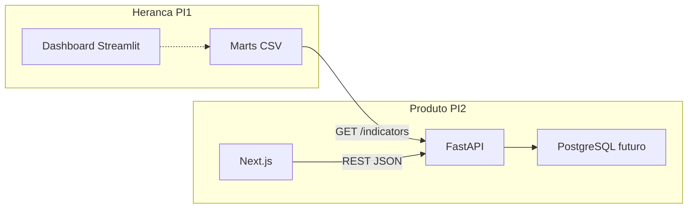

# Visão arquitetural — PI II

## Contexto

O PI I entregou evidência do problema (informalidade, confiança, rendimento). O PI II entrega um MVP web: diarista e contratante se encontram em pedidos de diária. Os marts do PI I são fonte read-only de indicadores.

## Contêineres (C4 simplificado)

1. **Web (Next.js)** — interface do MVP (landing, cadastro, pedidos).
2. **API (FastAPI)** — regras de negócio, indicadores e, depois, auth + CRUD.
3. **Marts PI I (CSV)** — snapshot analítico; não é o banco do produto.
4. **PostgreSQL (planejado)** — usuários, perfis, pedidos e avaliações.

## ADRs

### ADR 1 — Next.js + FastAPI

- Contexto: a ementa pede front-end, back-end e consumo de API; o PI I já está em Python.
- Decisão: Next.js no front e FastAPI no back.
- Consequência: dois processos locais; CORS na API; CI com job de Python e job de Node.

### ADR 2 — Marts do PI I como fonte de indicadores

- Contexto: não reescrever o Streamlit; ainda assim mostrar o problema na landing.
- Decisão: `GET /indicators/summary` lê os CSVs em `heritage/pi1/.../marts`.
- Consequência: números do produto acadêmico ficam rastreáveis à PNAD-C; o MVP não depende da SIDRA em runtime.

### ADR 3 — PostgreSQL e JWT ficam para o Módulo 4

- Contexto: Sprint 0 precisa de esqueleto executável, não do domínio persistido.
- Decisão: modelos Pydantic (`User`, `Profile`, `ServiceRequest`) existem sem repositório; auth é mock na UI.
- Consequência: o backlog do Módulo 4 implementa persistência e autenticação sem mudar o contrato visual das páginas.

## Qualidade

- Unitário: pytest na API (`/health`, `/indicators/summary`)
- Integração: API + banco (quando houver)
- Aceitação: `tests/e2e` (placeholder na Sprint 0)
- CI: GitHub Actions (pytest + `next build`)
